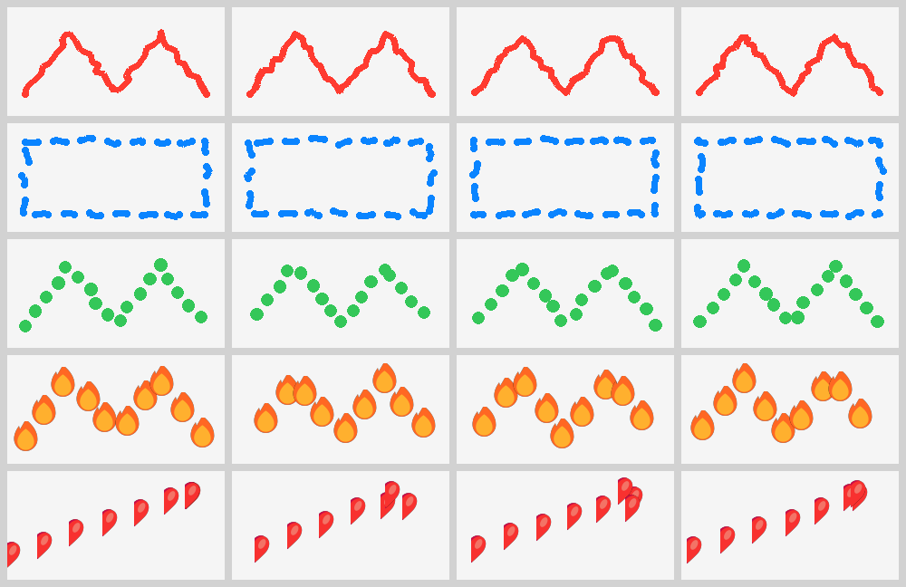

# SnipSquiggle

A cross-platform Snipping-Tool clone where your annotations are **squiggly and
animated**, and **Copy (Ctrl/Cmd+C) puts a looping GIF** on your clipboard.

Runs on **Windows** (fully tested), **macOS**, and **Linux**.

## What it does

1. **Launch** → select a screen region to snip.
   - **Windows / Linux:** the screen dims — drag a rectangle (Esc cancels).
   - **macOS:** the native `screencapture` crosshair.
2. **Editor** opens with your snip. Draw with **Pen**, **Arrow**, or **Box**,
   and pick an **animation style** per stroke:

   | Style   | Look                                            |
   |---------|-------------------------------------------------|
   | 〰 Boil  | hand-drawn squiggle that gently wobbles (default) |
   | ┅ Ants  | marching-ants moving dashes                     |
   | •• Dots | dots flowing along the stroke                   |
   | 😀 Emoji | emojis marching + bobbing along the stroke (🔥 ❤️ ⭐ ✅ 👍 …) |

   

   Optionally add a **company / logo watermark** with **💧 Logo** — pick any
   PNG/GIF/JPG (transparent PNG looks best), or re-pick one of your
   **recently-used** logos from the menu. It rides on the snip with a subtle
   water **ripple**. **Drag** it to reposition; **scroll** the mouse wheel over
   it to resize; **🚫** removes it.

3. **Copy (Ctrl/Cmd+C)** → a looping animated GIF is placed on the clipboard.
   Pastes as an **animated file** into Slack / Discord / Teams / Finder /
   Explorer, and as a **static image** into apps that only accept bitmaps.

## Run

```sh
pip install -r requirements.txt
python snipsquiggle.py
```

`requirements.txt` installs the right OS extras automatically
(`pywin32` on Windows, `pyobjc-framework-Cocoa` on macOS; nothing extra on Linux).

> **On macOS, do the one-time setup below first** — the system Python won't work.

## macOS setup (step by step)

The app is a Tk GUI, so it needs a Python built against **Tk 8.6**. The two
Pythons already on most Macs do **not** work:

- **Apple's Command Line Tools `python3`** links against **Tk 8.5**, which
  segfaults GUI apps ("Python quit unexpectedly").
- **Homebrew `python-tk`** pulls in **Tk 9.0**, whose bottle can require a newer
  macOS than you're running (`macOS 26 … required, have instead 16` → abort).

The reliable fix is the **official python.org installer**, which bundles its own
Tk 8.6 and runs on macOS 10.13+:

1. **Install Python from python.org.**
   Download the latest **“macOS 64-bit universal2 installer”** from
   <https://www.python.org/downloads/macos/> and run it. Works on Apple Silicon
   and Intel.

2. **Verify you have Tk 8.6** (this must print `8.6` and *not* abort):
   ```sh
   /usr/local/bin/python3 -c "import tkinter; print(tkinter.TkVersion)"
   ```
   > If `/usr/local/bin/python3` isn't found, use the full framework path, e.g.
   > `/Library/Frameworks/Python.framework/Versions/3.13/bin/python3`.

3. **Install dependencies and run** with *that* interpreter:
   ```sh
   cd snipsquiggle
   /usr/local/bin/python3 -m pip install -r requirements.txt
   /usr/local/bin/python3 snipsquiggle.py
   ```

4. **Grant Screen Recording permission** (first run only). macOS will prompt, or:
   System Settings → Privacy & Security → **Screen Recording** → enable your
   **Terminal** (or iTerm). Then **quit and reopen the terminal** — the
   permission only takes effect after a relaunch — and run step 3 again.
   Without it, snips come back as the desktop wallpaper only.

That's it. To avoid typing the long path, add an alias to `~/.zshrc`:
```sh
alias py='/usr/local/bin/python3'
# then:  py snipsquiggle.py
```

Notes:
- On Retina displays the snip is captured at 2× pixels, so the editor window can
  look large — that's expected; the exported GIF is crisp.
- Emoji use **Apple Color Emoji**. For emoji that look identical to Windows,
  drop a `NotoColorEmoji.ttf` into an `assets/` folder (see Platform notes).
- The app checks your Tk version at startup and exits with these instructions if
  it's too old, instead of crashing.

## Shortcuts (in the editor)

Use **Ctrl** on Windows/Linux, **Cmd** on macOS.

| Key         | Action              |
|-------------|---------------------|
| `⌃/⌘ + C`   | Copy animated GIF   |
| `⌃/⌘ + S`   | Save GIF to disk    |
| `⌃/⌘ + Z`   | Undo last stroke    |
| `⌃/⌘ + N`   | New snip            |
| `Esc`       | Quit                |

## Platform notes

- **macOS** — see [macOS setup](#macos-setup-step-by-step) above (needs Tk 8.6
  via the python.org installer + Screen Recording permission).
- **Linux**
  - Copying needs `xclip` (X11) or `wl-clipboard` (Wayland) installed; without
    them the GIF is still saved via **Save**.
  - Screenshot uses Pillow's `ImageGrab` (needs `scrot`/`gnome-screenshot` on
    some distros). Emoji use **Noto Color Emoji** if installed.
- **Consistent emoji across machines:** drop a color-emoji font at
  `assets/NotoColorEmoji.ttf` (or `assets/emoji.ttf`) and it's used on every
  platform, so GIFs look identical everywhere.

## Build a standalone app (optional)

Windows `.exe`:

```powershell
pip install pyinstaller
pyinstaller --onefile --windowed --name SnipSquiggle snipsquiggle.py
# result: dist\SnipSquiggle.exe
```

macOS `.app`:

```sh
pip install pyinstaller
pyinstaller --windowed --name SnipSquiggle snipsquiggle.py
# result: dist/SnipSquiggle.app
```

> `create_shortcut.py` and `make_icon.py` are Windows-only helpers (Start Menu
> shortcut + `.ico`). On macOS, drag the built `.app` to your Applications folder.

## Notes / knobs

Tuning constants live at the top of `snipsquiggle.py`:

- `N_FRAMES` – frames in the loop (more = smoother marching, bigger GIF)
- `FRAME_MS` – animation speed / GIF frame delay
- `JITTER_BASE` – how squiggly the lines are
- `RESAMPLE_SPACING` – wobble granularity
- `EMOJIS` – the emoji picker set

Each stroke precomputes `N_FRAMES` of backend-agnostic draw *ops* (lines, dots,
emoji stamps) that both the live canvas preview and the GIF exporter consume, so
what you see is exactly what gets copied. Add a new style by extending
`build_ops()`.

The GIF is 256-color (GIF format limit), so photo-heavy snips will dither a
little. The animated part is your drawing; the background stays put.

### Copying an animated GIF — why it's per-OS

No desktop clipboard has a single "animated image" format, so each OS needs its
own trick. SnipSquiggle writes a real `.gif` to a temp file and advertises it in
the way each platform's paste targets understand:

- **Windows** — `CF_HDROP` (the file), plus `CF_DIB` (static fallback) and a raw
  `GIF` format.
- **macOS** — `NSPasteboard` with `public.gif` + `public.png` data and a file URL.
- **Linux** — `xclip` / `wl-copy` with the `image/gif` target.
